# Books_Junction
 Books_Junction is an e-Commerce Reading Book's Shopping Android Application developed by using JAVA, XML and FIREBASE.
 
 
This is a static application where users cannot shop any books but can register, login themself with authentic email and can view their profile detail under My_profile section after successful login and also user can update their profile details and can change their password as well.
 
 
 This Application contains the Different categories of the Reading book’s like 
1 - Educational Book’s
2 - Story Book’s
3 - Novel’s
4 - Historical Book’s
5 - Science Fiction Books.  

 
 <h1>Screenshots of the Application</h1>

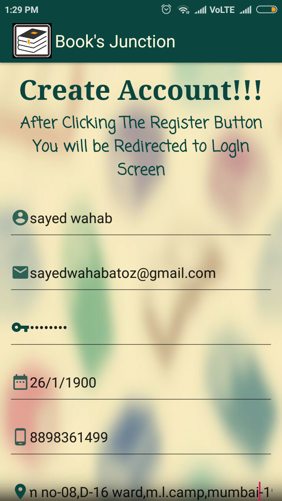 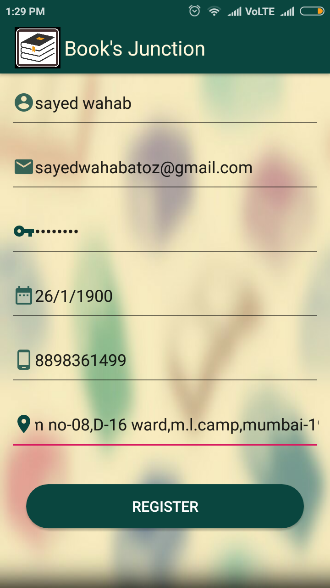

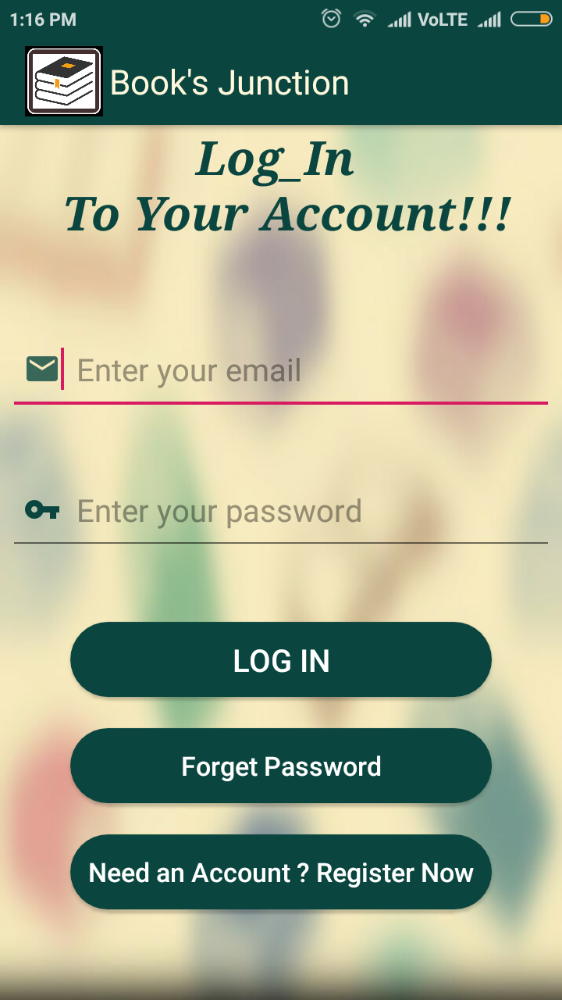 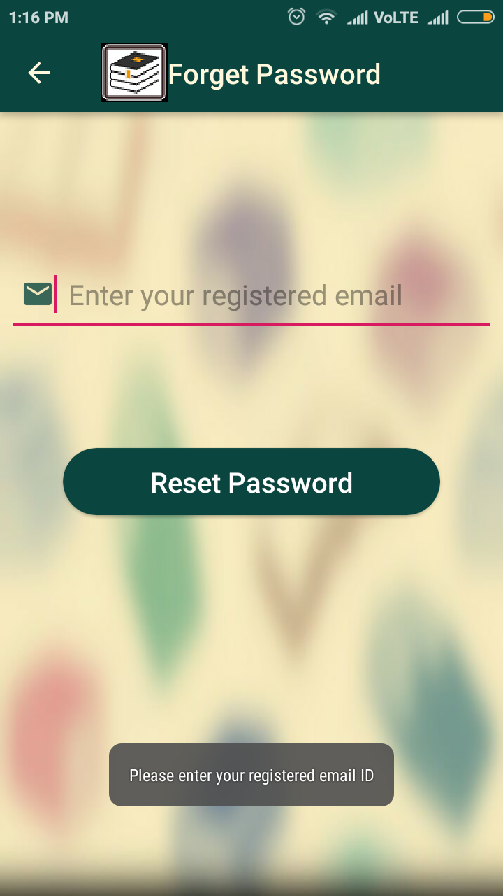

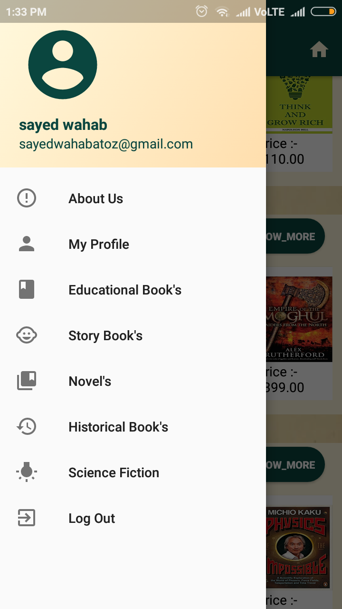 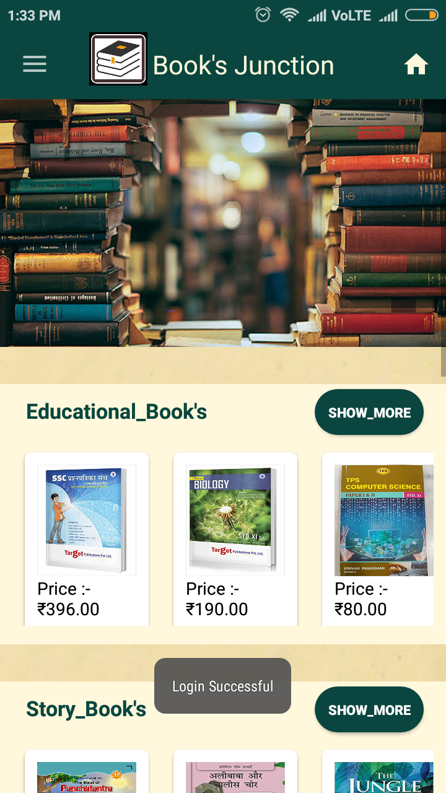

 

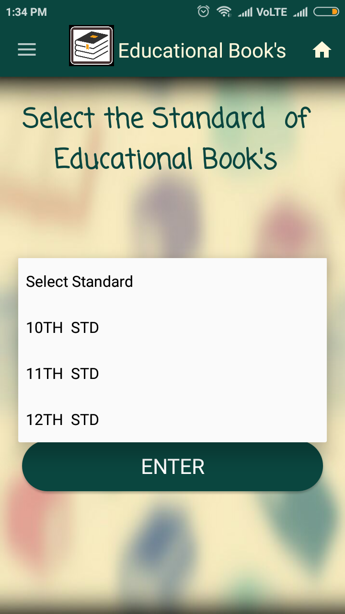 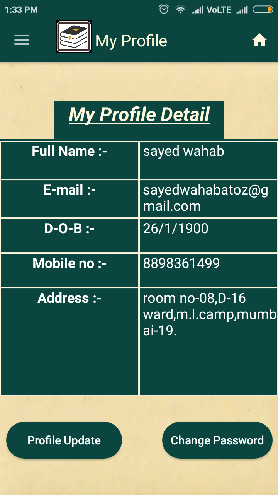

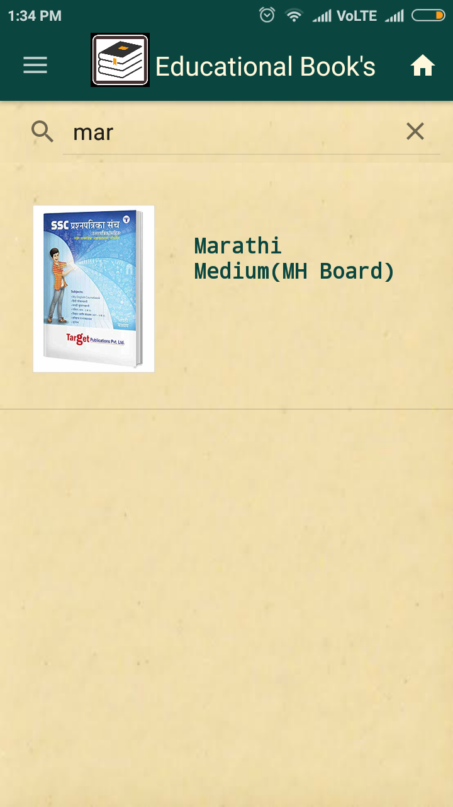 

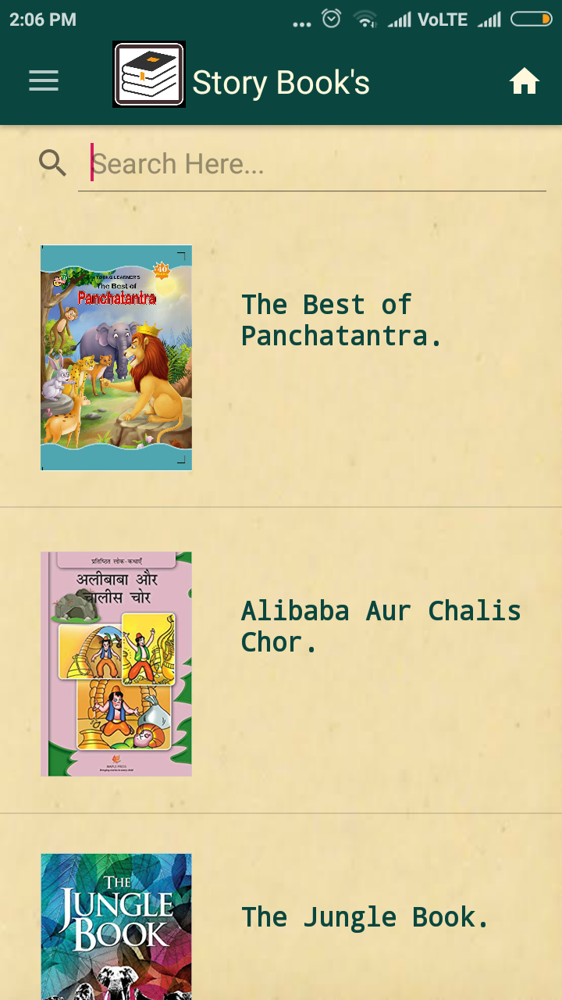 

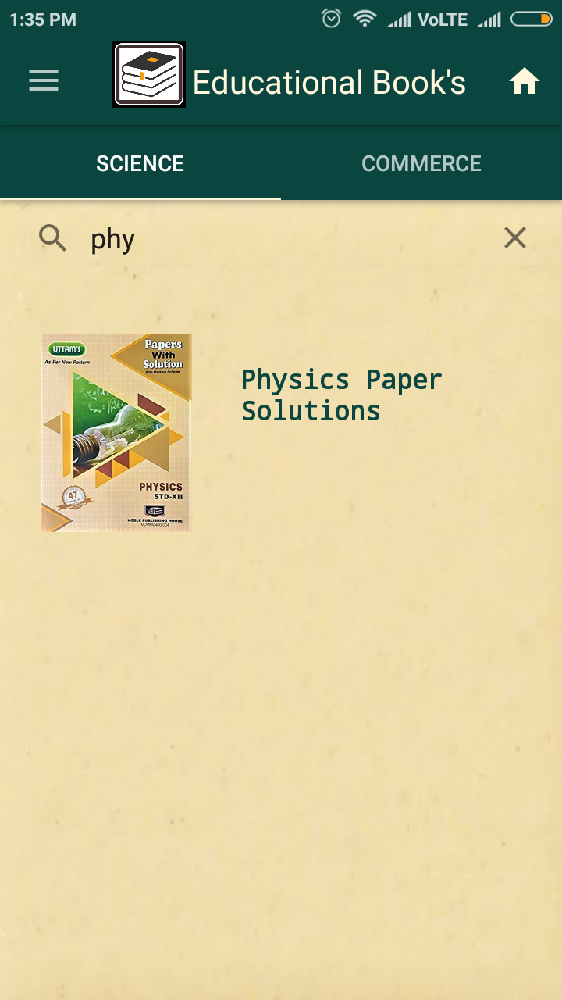 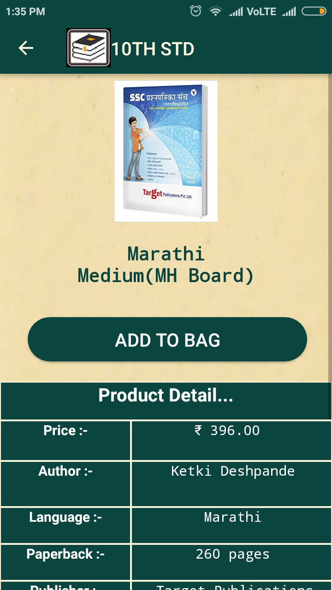

 
